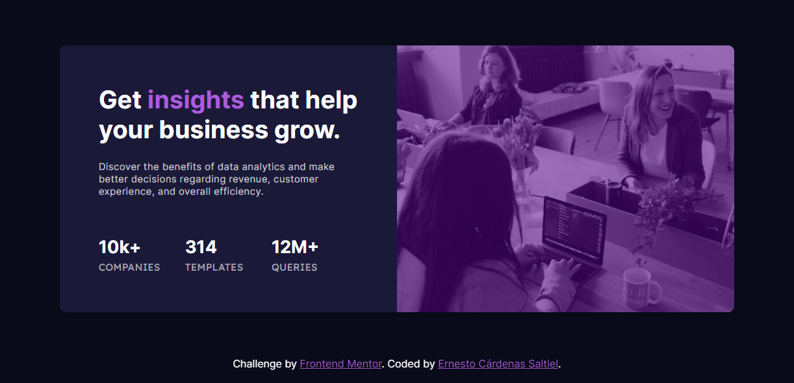

# Frontend Mentor - Stats preview card component solution

This is a solution to the [Stats preview card component challenge on Frontend Mentor](https://www.frontendmentor.io/challenges/stats-preview-card-component-8JqbgoU62). Frontend Mentor challenges help you improve your coding skills by building realistic projects. 

## Table of contents

- [Overview](#overview)
  - [The challenge](#the-challenge)
  - [Screenshot](#screenshot)
  - [Links](#links)
- [My process](#my-process)
  - [Built with](#built-with)
  - [What I learned](#what-i-learned)
  - [Continued development](#continued-development)
  - [Useful resources](#useful-resources)
- [Author](#author)


## Overview

### The challenge

Users should be able to:

- View the optimal layout depending on their device's screen size

### Screenshot



### Links

- Solution URL: [github.com/ernestoK-2000/stats-preview-card-component](https://github.com/ernestoK-2000/stats-preview-card-component)
- Live Site URL: [ernestoK-2000.github.io](https://ernestoK-2000.github.io)

## My process

### Built with

- HTML
- CSS
- Flexbox

### What I learned

As a programmer I found some CSS styling during the design phase kind of difficult. Nonetheless, thinking about completing the challenge, encourage me to find the solution to the positional problems that arose.

Padding was one of them. I wanted it to shrink with the window but also set a minimun value so some space could be maintain. However, there's no min-padding property in CSS. The solution I found:

```css
.text-container{
    padding: min(12%, 60px); 
}
```
Here padding is set to the minimun value between 12% of the parent width and 60px. CSS has these powerfull functions that are pretty usefull when you are looking for dynamism in your page styling.

I also inquire in properties that allow me to modify the HTML element order. It was needed to change the aspect of the card. Some properties that might do the trick:

- [flex-direction](https://developer.mozilla.org/en-US/docs/Web/CSS/flex-direction)
- [order](https://developer.mozilla.org/en-US/docs/Web/CSS/order)
- [float](https://developer.mozilla.org/en-US/docs/Web/CSS/float)

The next solution was used for inverting the image with the card information for the mobile version of the page:
```css
.content-container{
    flex-direction: column-reverse;
}
```

### Continued development

I want to focus more in responsiveness. Cellphones are used everywhere and a Mobile First Approach is definitely something I want to try out.

### Useful resources

They help me in every project:

- [Stack overflow](https://stackoverflow.com/) - For specific problems and questions.
- [w3shools](https://www.w3schools.com/) - Useful documentation, examples and exercises you can try and modify.
- [MDN Web Docs](https://developer.mozilla.org/) - Amazing documentation for web developers

## Author

- Website - [Personal Portfolio](https://ernestok-2000.github.io/)
- Frontend Mentor - [ernestoK-2000](https://www.frontendmentor.io/profile/ernestoK-2000)
- LinkedIn - [Ernesto Cardenas Saltiel](https://www.linkedin.com/in/ernesto-cardenas-saltiel-0135b0214/)


